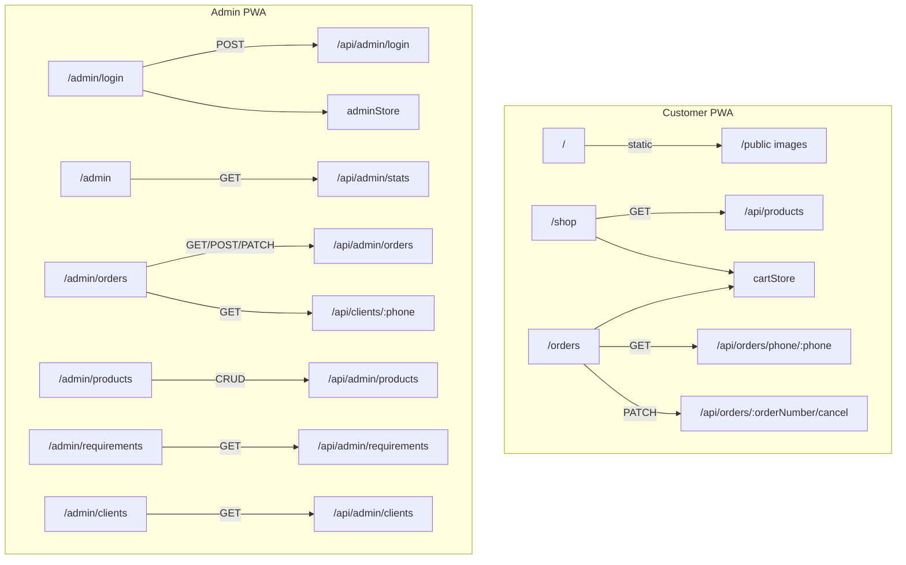

# Sampoornam Foods — Complete Routing & Architecture Audit

> Generated: March 9, 2026  
> Purpose: Map all routes, dependencies, and entry points for dual-PWA architecture planning

---

## 1. Complete Frontend Route Map

### Route Discovery

All routes generated by the Next.js 14 App Router from `client/app/`:

| Route                 | Source File                              | Route Type                     | Layout Hierarchy           |
| --------------------- | ---------------------------------------- | ------------------------------ | -------------------------- |
| `/`                   | `client/app/page.tsx`                    | Customer (Public)              | Root Layout                |
| `/shop`               | `client/app/shop/page.tsx`               | Customer (Public)              | Root Layout                |
| `/orders`             | `client/app/orders/page.tsx`             | Customer (Public)              | Root Layout                |
| `/bulk-orders`        | `client/app/bulk-orders/page.tsx`        | Customer (Public, Placeholder) | Root Layout                |
| `/admin`              | `client/app/admin/page.tsx`              | Admin (Protected)              | Root Layout → Admin Layout |
| `/admin/login`        | `client/app/admin/login/page.tsx`        | Authentication                 | Root Layout → Admin Layout |
| `/admin/orders`       | `client/app/admin/orders/page.tsx`       | Admin (Protected)              | Root Layout → Admin Layout |
| `/admin/products`     | `client/app/admin/products/page.tsx`     | Admin (Protected)              | Root Layout → Admin Layout |
| `/admin/requirements` | `client/app/admin/requirements/page.tsx` | Admin (Protected)              | Root Layout → Admin Layout |
| `/admin/clients`      | `client/app/admin/clients/page.tsx`      | Admin (Protected)              | Root Layout → Admin Layout |

**Total: 10 routes** (4 customer, 1 auth, 5 admin)

### Layout Files

| File                          | Scope             | Responsibilities                                                            |
| ----------------------------- | ----------------- | --------------------------------------------------------------------------- |
| `client/app/layout.tsx`       | All routes (`/`)  | Root HTML, fonts (Inter, Playfair Display), global CSS, metadata, dark mode |
| `client/app/admin/layout.tsx` | `/admin/*` routes | Sidebar navigation, auth guard, hamburger menu, logout                      |

---

## 2. Admin Route Group — Complete Hierarchy

```
/admin/                          ← Admin Layout wraps ALL of these
├── login/page.tsx               ← Authentication (exempt from auth guard)
├── page.tsx                     ← Dashboard (stats overview)
├── orders/
│   ├── page.tsx                 ← Order management
│   └── OfflineOrderModal.tsx    ← Modal component (not a route)
├── products/page.tsx            ← Product CRUD
├── requirements/page.tsx        ← Delivery target (daily aggregation)
└── clients/page.tsx             ← Client list & order history
```

### Admin Layout Behavior (`client/app/admin/layout.tsx`)

```
┌─────────────────────────────────────────┐
│           Auth Guard Logic              │
│                                         │
│  if (!isAuthenticated && path !== login) │
│      → redirect to /admin/login         │
│                                         │
│  if (path === /admin/login)             │
│      → render children WITHOUT sidebar  │
│                                         │
│  else                                   │
│      → render sidebar + children        │
└─────────────────────────────────────────┘
```

**Sidebar Navigation Items:**

| Label           | Route                 | Icon                         |
| --------------- | --------------------- | ---------------------------- |
| Dashboard       | `/admin`              | `HomeIcon`                   |
| Orders          | `/admin/orders`       | `ClipboardDocumentListIcon`  |
| Delivery Target | `/admin/requirements` | `ClipboardDocumentCheckIcon` |
| Products        | `/admin/products`     | `CubeIcon`                   |
| Clients         | `/admin/clients`      | `UserGroupIcon`              |

---

## 3. Complete Backend API Endpoint List

### Route Mounting (`server/index.js`)

```
app.use("/api/products", productRoutes)    → server/routes/products.js
app.use("/api/orders", orderRoutes)        → server/routes/orders.js
app.use("/api/admin", adminRoutes)         → server/routes/admin.js
app.use("/api/clients", clientRoutes)      → server/routes/clients.js
app.get("/api/health", ...)                → inline health check
```

### Public API Endpoints

| Method  | Endpoint                          | Description                                                            | Source        |
| ------- | --------------------------------- | ---------------------------------------------------------------------- | ------------- |
| `GET`   | `/api/products`                   | List products (filters: `?category=`, `?featured=true`, `?available=`) | `products.js` |
| `GET`   | `/api/products/:slug`             | Get product by slug                                                    | `products.js` |
| `POST`  | `/api/orders`                     | Create order → returns WhatsApp URL, upserts Client                    | `orders.js`   |
| `GET`   | `/api/orders/:orderNumber`        | Track order by order number                                            | `orders.js`   |
| `GET`   | `/api/orders/phone/:phone`        | List all orders by phone number                                        | `orders.js`   |
| `PATCH` | `/api/orders/:orderNumber/cancel` | Cancel order (customer-initiated)                                      | `orders.js`   |
| `GET`   | `/api/clients/:phone`             | Get client by phone (auto-fill)                                        | `clients.js`  |
| `POST`  | `/api/clients`                    | Upsert client (create or update)                                       | `clients.js`  |
| `GET`   | `/api/health`                     | Health check                                                           | `index.js`    |

### Admin API Endpoints (JWT Required)

| Method   | Endpoint                           | Description                                                | Source     |
| -------- | ---------------------------------- | ---------------------------------------------------------- | ---------- |
| `POST`   | `/api/admin/login`                 | Login → returns JWT token                                  | `admin.js` |
| `GET`    | `/api/admin/products`              | List all products (including hidden)                       | `admin.js` |
| `POST`   | `/api/admin/products`              | Create product                                             | `admin.js` |
| `PUT`    | `/api/admin/products/:id`          | Update product                                             | `admin.js` |
| `DELETE` | `/api/admin/products/:id`          | Delete product                                             | `admin.js` |
| `GET`    | `/api/admin/orders`                | List orders (filter: `?status=`)                           | `admin.js` |
| `POST`   | `/api/admin/orders`                | Create offline order (phone/walk-in)                       | `admin.js` |
| `PATCH`  | `/api/admin/orders/:id/status`     | Update status (sequence enforced, secret key for backward) | `admin.js` |
| `GET`    | `/api/admin/requirements`          | Daily delivery target (`?date=YYYY-MM-DD`)                 | `admin.js` |
| `GET`    | `/api/admin/clients`               | List all clients                                           | `admin.js` |
| `GET`    | `/api/admin/clients/:phone/orders` | Client order history by phone                              | `admin.js` |
| `GET`    | `/api/admin/stats`                 | Dashboard overview stats                                   | `admin.js` |

**Total: 21 endpoints** (9 public, 12 admin)

---

## 4. Page → API Dependency Map

### Customer Pages

#### `/` (Homepage)

```
Components: AppHeader, BottomNav, HeroBanner, TrustBadges,
            SignatureCollections, Footer, CartDrawer
API Calls:  None (static content, images from /public)
Stores:     cartStore (via CartDrawer)
```

#### `/shop` (Product Catalog)

```
Components: AppHeader, BottomNav, CartDrawer, ProductCard
API Calls:  GET /api/products
            GET /api/products?category=sweets
            GET /api/products?category=namkeens
Stores:     cartStore (addItem, removeItem, updateQuantity)
```

#### `/orders` (Order Tracking)

```
Components: AppHeader, BottomNav, CartDrawer
API Calls:  GET /api/orders/phone/:phone
            GET /api/orders/:orderNumber
            PATCH /api/orders/:orderNumber/cancel
Stores:     cartStore (for repeat order functionality)
```

#### `/bulk-orders` (Placeholder)

```
Components: AppHeader
API Calls:  None (coming soon page)
Stores:     None
```

### Admin Pages

#### `/admin/login` (Authentication)

```
Components: None (self-contained form)
API Calls:  POST /api/admin/login
Stores:     adminStore (setToken, isAuthenticated)
```

#### `/admin` (Dashboard)

```
Components: None (stat cards inline)
API Calls:  GET /api/admin/stats
Stores:     adminStore (getToken)
```

#### `/admin/orders` (Order Management)

```
Components: OfflineOrderModal
API Calls:  GET /api/admin/orders
            GET /api/admin/orders?status=<filter>
            PATCH /api/admin/orders/:id/status
            POST /api/admin/orders (offline order)
            GET /api/admin/products (for OfflineOrderModal)
            GET /api/clients/:phone (for OfflineOrderModal auto-fill)
Stores:     adminStore (getToken)
External:   api.whatsapp.com/send (WhatsApp notify link)
```

#### `/admin/products` (Product CRUD)

```
Components: None (inline modal forms)
API Calls:  GET /api/admin/products
            POST /api/admin/products
            PUT /api/admin/products/:id
            DELETE /api/admin/products/:id
Stores:     adminStore (getToken)
```

#### `/admin/requirements` (Delivery Target)

```
Components: None (inline)
API Calls:  GET /api/admin/requirements?date=YYYY-MM-DD
Stores:     adminStore (getToken)
```

#### `/admin/clients` (Client Management)

```
Components: None (inline)
API Calls:  GET /api/admin/clients
            GET /api/admin/clients/:phone/orders
Stores:     adminStore (getToken)
```

### Dependency Diagram



---

## 5. PWA Entry Point Analysis

### Recommended Configuration

#### Customer PWA

| Property           | Value            | Rationale                                      |
| ------------------ | ---------------- | ---------------------------------------------- |
| `name`             | Sampoornam Foods | Brand name                                     |
| `short_name`       | Sampoornam       | For home screen                                |
| `start_url`        | `/`              | Homepage as landing                            |
| `scope`            | `/`              | Covers `/`, `/shop`, `/orders`, `/bulk-orders` |
| `display`          | `standalone`     | Native app feel                                |
| `theme_color`      | `#0a0a0a`        | Dark theme background                          |
| `background_color` | `#0a0a0a`        | Splash screen                                  |

**Routes in scope:**

```
/                    ✅ Homepage
/shop                ✅ Product catalog
/shop?category=*     ✅ Filtered catalog
/orders              ✅ Order tracking
/bulk-orders         ✅ Future bulk orders
```

#### Admin PWA

| Property           | Value            | Rationale                  |
| ------------------ | ---------------- | -------------------------- |
| `name`             | Sampoornam Admin | Distinct from customer app |
| `short_name`       | SF Admin         | For home screen            |
| `start_url`        | `/admin`         | Dashboard as landing       |
| `scope`            | `/admin`         | Only admin routes          |
| `display`          | `standalone`     | Native app feel            |
| `theme_color`      | `#0a0a0a`        | Same dark theme            |
| `background_color` | `#0a0a0a`        | Splash screen              |

**Routes in scope:**

```
/admin               ✅ Dashboard
/admin/login         ✅ Authentication
/admin/orders        ✅ Order management
/admin/products      ✅ Product CRUD
/admin/requirements  ✅ Delivery target
/admin/clients       ✅ Client management
```

### Manifest Files (Proposed)

```
client/public/manifest.json          → Customer PWA manifest
client/public/admin-manifest.json    → Admin PWA manifest
```

> [!IMPORTANT]
> Next.js only supports a single `manifest.json` by default. For dual-PWA, you'll need either:
>
> 1. **Route-based manifest switching** using `<link rel="manifest">` in separate layout `<head>` tags
> 2. **Separate service workers** with different scopes (`/` and `/admin/`)
> 3. **Middleware-based** manifest serving based on the request path

---

## 6. Security Check

### ✅ Admin Route Protection

| Check                                | Status  | Details                                                     |
| ------------------------------------ | ------- | ----------------------------------------------------------- |
| Auth guard on admin routes           | ✅ Pass | `admin/layout.tsx` checks `isAuthenticated()` on mount      |
| Redirect to login if unauthenticated | ✅ Pass | Redirects to `/admin/login`                                 |
| Login page exempt from auth          | ✅ Pass | Condition: `pathname !== "/admin/login"`                    |
| Backend JWT validation               | ✅ Pass | All admin endpoints use `adminAuth` middleware              |
| Status backtrack protection          | ✅ Pass | Backward status changes require `secretKey === ADMIN_PHONE` |

### ✅ Admin Links Not Exposed to Customers

| Check                                      | Status | Details                           |
| ------------------------------------------ | ------ | --------------------------------- |
| AppHeader contains `/admin` link           | ✅ No  | No admin links in customer header |
| BottomNav contains `/admin` link           | ✅ No  | No admin links in mobile nav      |
| Footer contains `/admin` link              | ✅ No  | No admin links in footer          |
| Any customer component references `/admin` | ✅ No  | Clean separation                  |

### ✅ Admin Login Behavior

```
Flow:
1. Navigate to /admin (or any /admin/* route)
2. admin/layout.tsx mounts, checks adminStore.isAuthenticated()
3. If no valid token → redirect to /admin/login
4. User enters phone + password → POST /api/admin/login
5. Server validates against env vars (ADMIN_PHONE, ADMIN_PASSWORD)
6. Returns JWT token → stored in adminStore (localStorage)
7. Redirect to /admin (dashboard)
```

### ⚠️ Potential Risks

| Risk                                                 | Severity | Notes                                                                                                                                               |
| ---------------------------------------------------- | -------- | --------------------------------------------------------------------------------------------------------------------------------------------------- |
| Admin auth is client-side only during initial render | Low      | Server-side rendering shows brief flash before redirect. Backend still validates JWT on every API call, so no data leaks.                           |
| JWT stored in localStorage                           | Low      | Standard for admin-only apps. Consider `httpOnly` cookies for production.                                                                           |
| `/bulk-orders` is a placeholder                      | Info     | Currently shows "Coming Soon" — no functionality. Consider removing from production or implementing.                                                |
| `/api/clients` endpoints are public                  | Medium   | `GET /api/clients/:phone` and `POST /api/clients` are not JWT-protected. They expose client lookup by phone. Consider adding auth or rate limiting. |
| CORS limited to localhost                            | Info     | Currently only allows `localhost:7000` and `localhost:3000`. Must update for production deployment.                                                 |

---

## Summary

```
┌──────────────────────────────────────────┐
│          SAMPOORNAM ARCHITECTURE         │
├──────────────────────────────────────────┤
│                                          │
│  Frontend Routes:  10  (4 customer,      │
│                         1 auth,          │
│                         5 admin)         │
│                                          │
│  Backend Endpoints: 21  (9 public,       │
│                          12 admin)       │
│                                          │
│  Zustand Stores:    2   (cartStore,      │
│                          adminStore)     │
│                                          │
│  Layouts:           2   (Root,           │
│                          Admin)          │
│                                          │
│  PWA Scopes:        2   (/  and /admin)  │
│                                          │
│  Security:          ✅  All admin routes  │
│                         protected        │
│                                          │
└──────────────────────────────────────────┘
```
